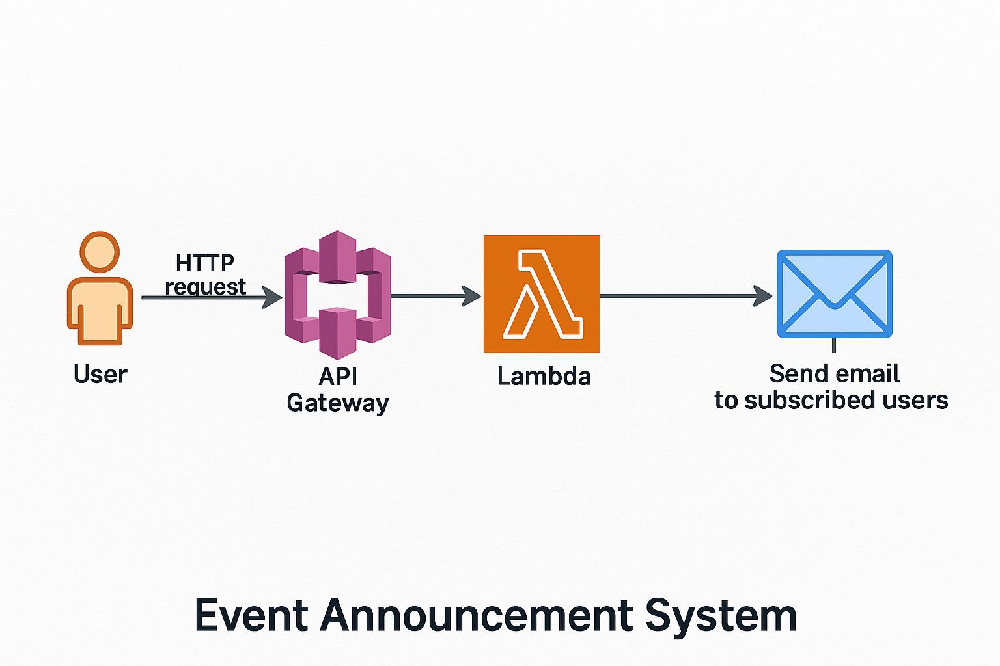
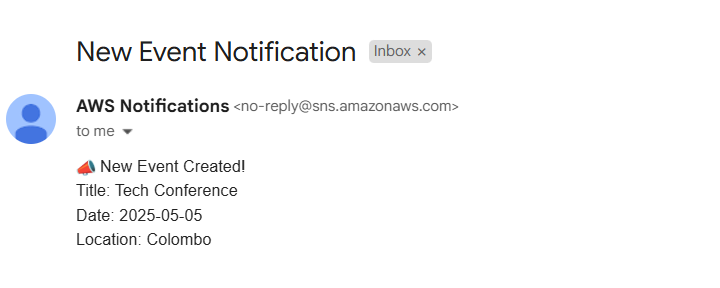

# 📣 Event Announcement System — AWS Cloud Project

This project is a cloud-based **Event Announcement System** that allows users to create events and notify subscribers via email in real time. It uses AWS services such as **Lambda**, **SNS**, **API Gateway**, and **IAM**.


> ✅ Developed as part of an AWS learning assignment using only the AWS Free Tier.

---

## 📌 Features

- 📬 Send email notifications about new events
- ✅ Triggered by HTTP request via API Gateway
- 🧠 Processes events using AWS Lambda
- 🔐 IAM roles for secure access
- 📧 AWS SNS sends emails to subscribers instantly

---

## 🧱 Architecture Overview



**Workflow:**
1. A user sends an HTTP request to API Gateway.
2. API Gateway triggers the Lambda function.
3. Lambda publishes the event to an SNS Topic.
4. SNS sends emails to all subscribed users.

---

##  AWS Services Used

| Service         | Purpose                                                  |
|-----------------|----------------------------------------------------------|
| **Lambda**      | Processes incoming events and sends messages to SNS      |
| **SNS**         | Distributes emails to all subscribers                    |
| **API Gateway** | Public HTTP endpoint to invoke Lambda                    |
| **IAM Roles**         | Grants necessary permissions to Lambda                   |

---

## How to Test the System (Step-by-Step)

###  1. Create an SNS Topic

Go to **AWS SNS Console** → Topics → Create Topic  
- Type: Standard  
- Name: `EventAnnouncements`

.png)

###  2. Create the Lambda Function
   - Use the `lambda_function.py` code 
   - Set up IAM role with `SNS:Publish` permission
   - Replace the SNS Topic ARN in the code

###  3. Create an API Gateway
   - Create a new REST or HTTP API
   - Connect it to your Lambda function

### 4. Trigger with Test Payload
   - Use Postman,or cURL or a test client to send this JSON:

```json
{
  "title": "Tech Conference 2025",
  "date": "2025-05-10",
  "location": "Colombo"
}
```

** Your email (subscribed to SNS) should receive: **
````
📣 New Event Created!

Title: Tech Conference 2025
Date: 2025-05-10
Location: Colombo
````


📩 Confirm the subscription from your email inbox.



